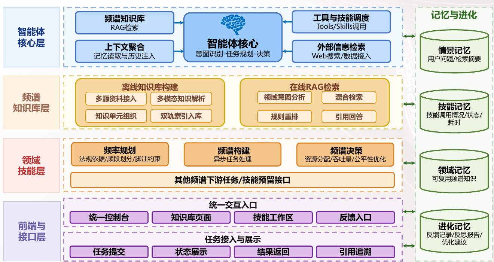
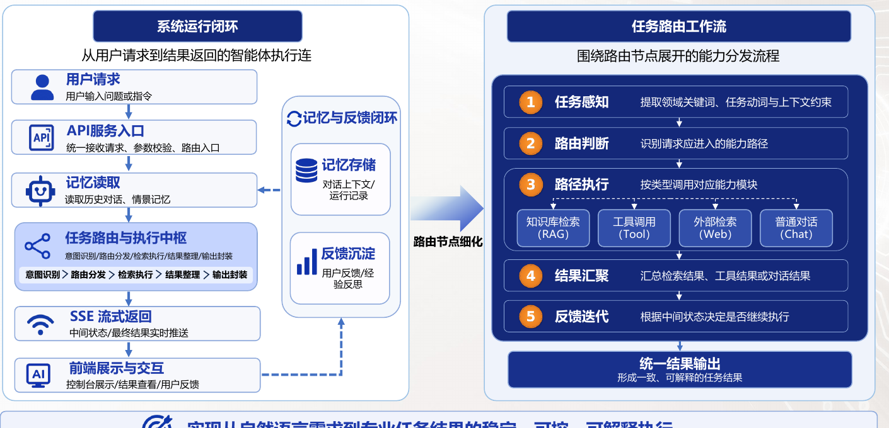
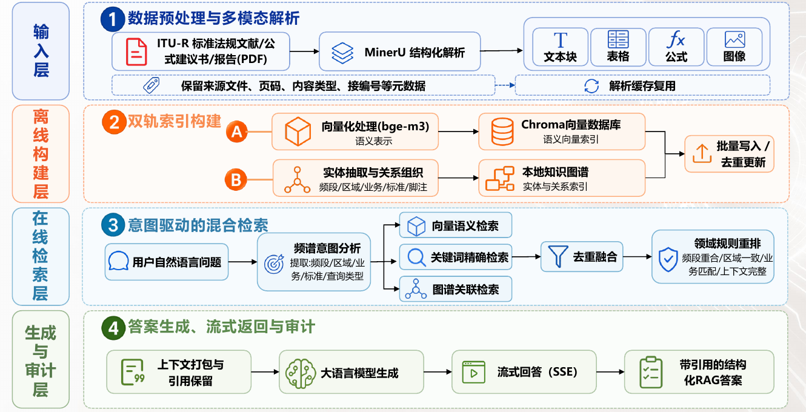

<div align="center">

# ✦ SpectrumClaw

### 面向电磁频谱领域的认知增强智能体系统

*让自然语言需求转化为可追溯、可执行、可解释的频谱专业任务。*

[](https://www.python.org/)
[](https://fastapi.tiangolo.com/)
[](https://react.dev/)

</div>

---

## 项目简介

SpectrumClaw 是一个面向电磁频谱工程任务的智能体工作台。它以统一控制台为入口，将大语言模型、领域知识增强检索、任务路由、专业技能与运行记忆组织为协同系统，支持用户从自然语言问题直接进入频率规划、频谱态势构建、频谱资源决策与专业知识问答。

系统强调三件事：**依据可追溯**、**任务可执行**、**结果可解释**。每次任务均可结合领域知识、工具或专业算法完成，并将结果、引用与运行信息以结构化形式呈现。

## 核心亮点

| ✨ 能力 | 面向的问题 | 价值 |
| --- | --- | --- |
| 🧠 智能体任务编排 | 频谱问题类型多、执行链路复杂 | 从意图识别到结果汇聚，自动分发知识库、工具、网页检索或领域技能 |
| 📚 知识增强检索 | 法规标准与专业资料难以高效利用 | 融合向量、关键词与知识图谱检索，输出保留引用依据的回答 |
| 🛰️ 频谱领域技能 | 通用对话难以直接支撑工程任务 | 提供频率规划、频谱构建与频谱决策等可组合技能 |
| 🔄 记忆与进化 | 运行经验与用户反馈难以沉淀 | 记录会话、任务运行与反馈，为后续任务提供上下文支撑 |
| 🖥️ 统一交互工作台 | 专业任务结果分散、过程不可见 | 以流式交互展示任务状态、结果、引用和反馈入口 |

## 系统架构

SpectrumClaw 由智能体核心、频谱知识库、领域技能、记忆进化与统一交互入口组成。智能体根据任务意图调度知识检索、工具调用和专业技能，并把运行过程沉淀为可复用的记忆。

<p align="center">
  
</p>

> **总体架构**：面向频谱任务构建“智能体编排—知识增强—技能执行—记忆沉淀”的完整闭环。

## 智能体工作流

用户通过自然语言提交需求后，系统读取必要的上下文，完成任务感知与路由判断；随后调用相应的 RAG、工具、外部检索或对话能力，并通过 SSE 实时返回中间状态与最终结果。

<p align="center">
  
</p>

> **任务执行闭环**：从自然语言需求到专业任务结果，实现稳定、可控、可解释的执行过程。

## 知识增强检索

针对 ITU-R 标准法规、建议书和报告等专业资料，SpectrumClaw 支持多模态解析、双轨索引构建与意图驱动的混合检索。系统结合领域规则重排与上下文引用保留，使回答不仅给出结论，也能够说明结论的来源。

<p align="center">
  
</p>

> **知识增强链路**：从资料构建、混合检索到引用追溯，提升频谱专业问答的可靠性。

## 已实现功能

| 功能模块 | 功能说明 |
| --- | --- |
| 💬 智能体 Console | 流式对话、任务思考过程展示、工具调用与结构化结果呈现 |
| 📖 频谱知识问答 | 专业资料检索、混合召回、领域规则重排与带引用回答 |
| 📡 频率规划 | 输出频段划分、业务状态、脚注限制、相邻频段与共存约束建议 |
| 🗺️ 频谱构建 | 支持多分辨率功率地图预览、稀疏观测模拟与频谱重建结果展示 |
| ⚖️ 频谱决策 | 面向多用户、多业务场景的频谱资源分配、吞吐量与公平性优化 |
| 🧩 记忆与反馈 | 会话、检索、技能调用与用户反馈记录，并支持反思报告生成 |
| 🔎 工具协作 | 集成时间、系统状态、天气、网页搜索、网页抓取与知识库工具 |

## 技术栈

| 方向 | 技术选型 |
| --- | --- |
| 前端交互 | React · Vite · lucide-react · react-markdown |
| 后端服务 | FastAPI · Uvicorn · Pydantic · httpx |
| 智能体编排 | LangGraph · LangChain Core |
| 大模型接入 | DeepSeek · OpenAI · Qwen 及兼容接口 |
| 知识增强 | ChromaDB · bge-m3 · MinerU · 知识图谱 · 混合检索与重排 |
| 数值优化 | NumPy · SciPy · scikit-learn |
| 运行记忆 | SQLite · JSON Registry |

## 快速开始

### 1. 获取代码

```bash
git clone https://github.com/weiyifan1219/SpectrumClaw.git
cd SpectrumClaw
```

### 2. 安装后端依赖

```bash
conda env create -f environment.yml
conda activate SpectrumClaw
```

或使用虚拟环境：

```bash
python -m venv .venv
source .venv/bin/activate
python -m pip install -r requirements.txt
```

### 3. 安装前端依赖并配置模型

```bash
npm --prefix frontend install
cp .env.example .env
```

在 `.env` 中配置一个可用的大模型服务：

```env
SPECTRUMCLAW_AGENT_RUNTIME=langgraph
SPECTRUMCLAW_LLM_PROVIDER=deepseek
SPECTRUMCLAW_LLM_BASE_URL=
SPECTRUMCLAW_LLM_API_KEY=
SPECTRUMCLAW_LLM_MODEL=
```

### 4. 启动服务

终端一：

```bash
scripts/local/start_backend.sh
```

终端二：

```bash
scripts/local/start_frontend.sh
```

打开浏览器访问 `http://127.0.0.1:5173/`，即可进入 SpectrumClaw 工作台。

## 贡献

欢迎通过 Issue 或 Pull Request 参与改进。若你正在构建新的频谱知识能力、领域技能或交互体验，欢迎与 SpectrumClaw 一起扩展电磁频谱智能体的边界。
