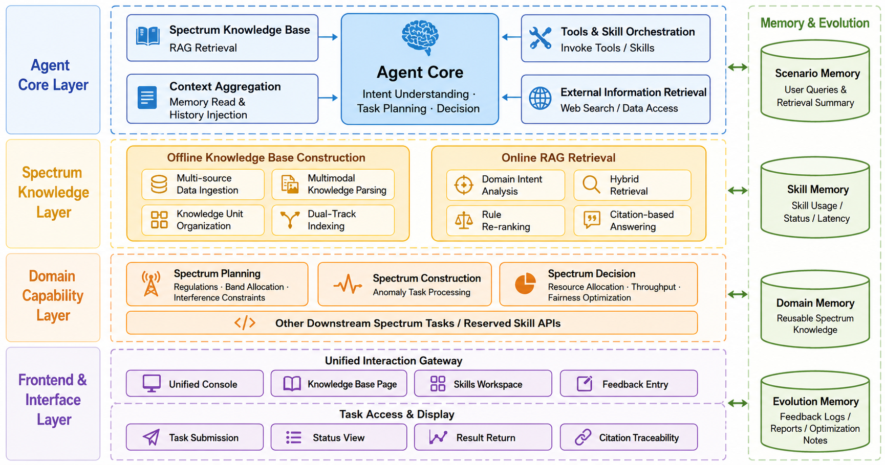
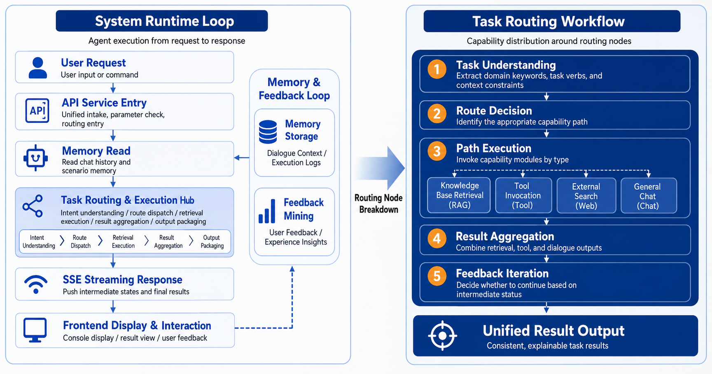
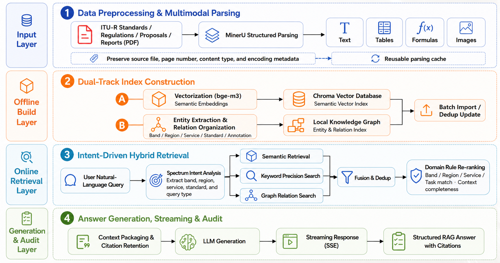

<div align="center">

# ✦ SpectrumClaw

### A Cognition-Augmented Agent System for the Electromagnetic Spectrum

[中文](README.md) · English

*Turning natural-language requests into traceable, executable, and explainable spectrum tasks.*

</div>

---

## Overview

SpectrumClaw is an agent workbench for electromagnetic-spectrum engineering. It combines large language models, knowledge-augmented retrieval, task routing, domain skills, and operational memory in one interactive workspace.

The system focuses on three outcomes: **traceable evidence**, **executable tasks**, and **explainable results**.

## Highlights

| Capability | Value |
| --- | --- |
| Agent task orchestration | Routes each request to retrieval, tools, web search, or spectrum skills. |
| Knowledge-augmented retrieval | Combines vector, keyword, and knowledge-graph retrieval with cited answers. |
| Spectrum domain skills | Supports frequency planning, spectrum construction, and spectrum decision-making. |
| Memory and evolution | Records task runs and feedback to provide useful context for future work. |
| Unified workbench | Streams task status, results, citations, and feedback in one interface. |

## System Architecture

<p align="center"></p>

> **Architecture**: a closed loop of agent orchestration, knowledge augmentation, skill execution, and memory evolution.

## Agent Workflow

<p align="center"></p>

> **Workflow**: from a natural-language request to a stable, controllable, and explainable professional result.

## Knowledge-Augmented Retrieval

<p align="center"></p>

> **Retrieval pipeline**: multimodal parsing, dual-track indexing, hybrid retrieval, domain reranking, and citation-aware answers.

## Implemented Features

| Module | Description |
| --- | --- |
| Agent Console | Streaming chat, visible task progress, tool calls, and structured results. |
| Spectrum Knowledge Q&A | Professional document retrieval with hybrid recall, reranking, and citations. |
| Frequency Planning | Band allocation, regulatory constraints, footnotes, adjacent bands, and coexistence guidance. |
| Spectrum Construction | Multi-resolution power-map previews, sparse-observation simulation, and reconstruction views. |
| Spectrum Decision | Multi-user and multi-service resource allocation with throughput and fairness optimization. |
| Memory & Feedback | Records conversations, retrievals, skill runs, feedback, and reflection reports. |

## Technology

React · Vite · FastAPI · LangGraph · LangChain · ChromaDB · bge-m3 · MinerU · NumPy · SciPy · SQLite

## Quick Start

```bash
git clone https://github.com/weiyifan1219/SpectrumClaw.git
cd SpectrumClaw
conda env create -f environment.yml
conda activate SpectrumClaw
npm --prefix frontend install
cp .env.example .env
```

Configure an available LLM provider in `.env`, then start the backend and frontend in separate terminals:

```bash
scripts/local/start_backend.sh
scripts/local/start_frontend.sh
```

Open `http://127.0.0.1:5173/` to enter the workbench.

## Contributing

Issues and pull requests are welcome. Contributions that extend spectrum knowledge, domain skills, or the interactive experience are especially appreciated.
